# 1.1 - Data Strategy

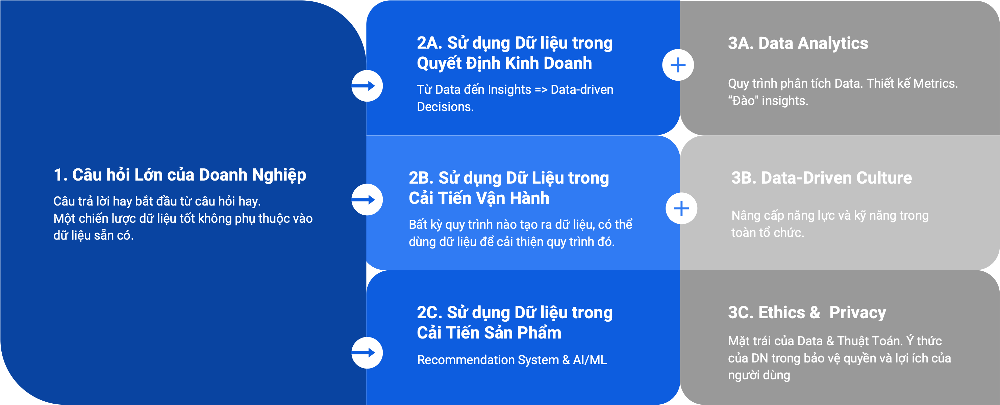

## WHAT Data?

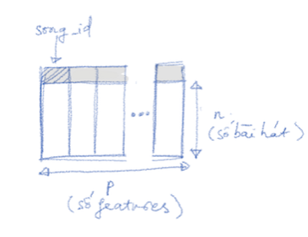

1. Dữ liệu phổ biến nhất có dạng bảng, gồm nhiều dòng (records) và cột (thông tin)
2. Dữ liệu dạng bảng nằm ở: Sao kê ngân hàng, hoá đơn, danh sách đăng ký, thu chi trong tháng...

Ví dụ 1. Danh sách đăng ký            |  Ví dụ 2. Hoá đơn
:-------------------------:|:-------------------------:
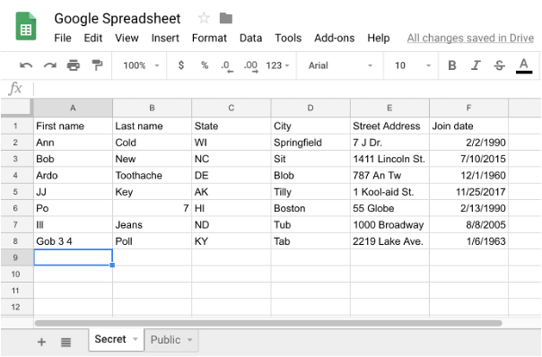  |  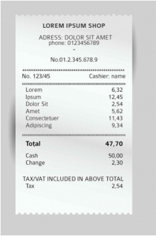

### Big Data

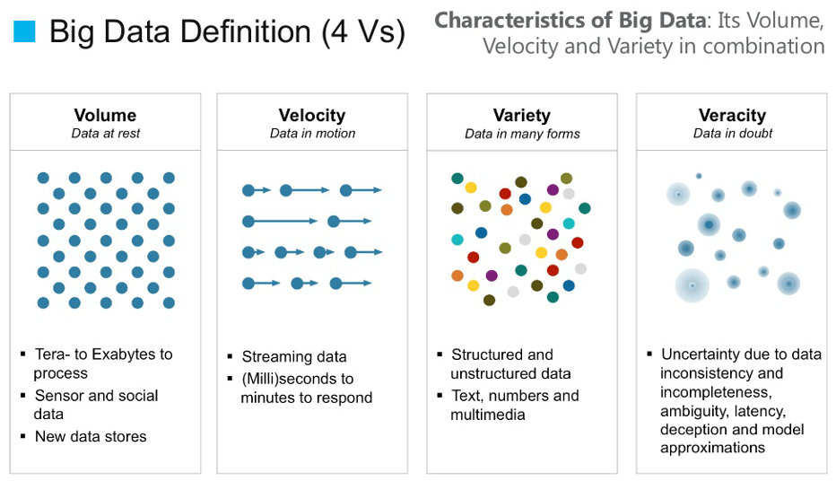

1. Big Data trở thành “buzzword"
2. Tăng lên về: 
   - Khối lượng (Volume)
   - Tần suất (Velocity)
   - Sự Đa Dạng(Variety)
   - Chất lượng (Veracity)
3. Khi nhấn mạnh “Big" ta quên đi chữ “V" thứ 5: VALUE

### Take-away #1: SMART Data not Big Data

1. Every Business can Data (Mọi DN đều tạo ra dữ liệu)
2. Dữ liệu không phải lúc nào cũng hữu ích. DN nhỏ càng cần chọn lọc
3. Dữ liệu chỉ có ý nghĩa khi tạo ra giá trị. Dữ liệu cần giải quyết một vấn đề/nhu cầu cụ thể của DN (Chiến lược Dữ liệu)
4. Bắt đầu bằng Chiến lược thay vì Data (bạn đang có)

## WHERE Data FROM?

1. Bất kỳ Doanh Nghiệp (DN) nào cũng là một DN dữ liệu
2. Bất kỳ Quy trình nào cũng có thể tracking => Dữ liệu => Dùng dữ liệu để tối ưu hoá chính quy trình đó 

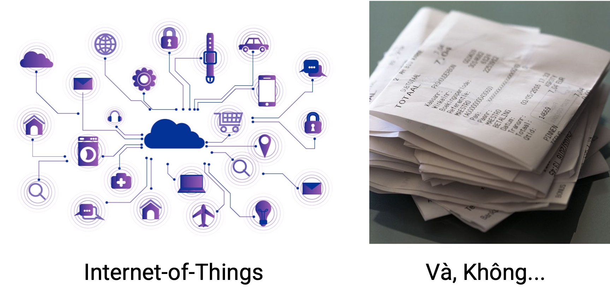

### Data Solution - Hai-mươi-bảy Pre-order

Quy Trình Pre-ordering:
1. Độc giả:
   - Truy cập website
   - Điền thông tin Đơn Hàng (MS, Tên, địa chỉ, số lượng…)
   - Nhấn nút “request" cập nhật Trạng Thái Đơn Hàng (Nhận chuyển khoản, Đã gửi, Đã nhận)
2. Người bán:
   - Check các Đơn Hàng
   - Trạng Thái Đơn Hàng (Nhận chuyển khoản, Đã gửi, Đã nhận)
3. Reporting Dashboard (Project members):
   - Đã bán được bao nhiêu sách
   - Bao nhiêu đã chuyển khoản, gửi đi...

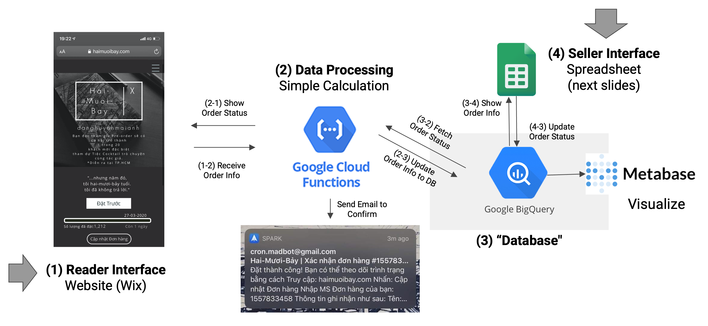

Database            |  Visualize
:-------------------------:|:-------------------------:
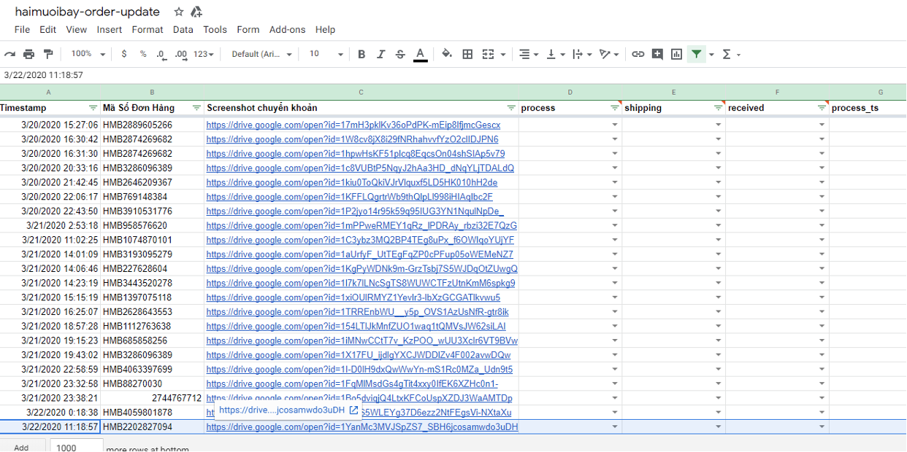  |  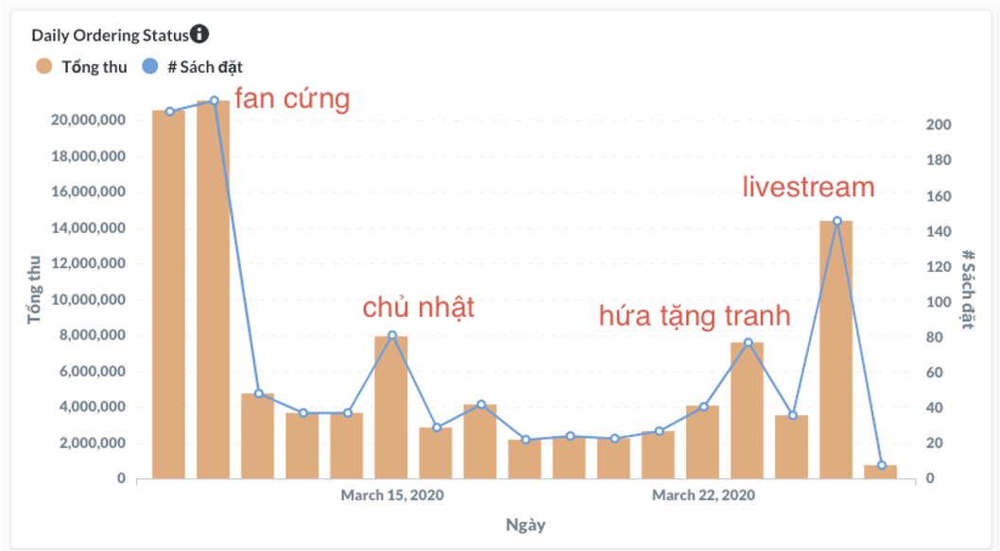

### Take-away #2: Giải Pháp Dữ liệu Bình Dân

1. Không đủ kinh phí không nên là mối bận tâm
2. Có nhiều giải pháp Dữ liệu giá cả rất bình dân, sử dụng Cloud Service + Open-source (Gần như miễn phí cho scale nhỏ và siêu nhỏ)
3. “Lợi thế của người đến sau” - Tận dụng các giải pháp mới (modernized & democratized)

## Data Strategy - HOW?

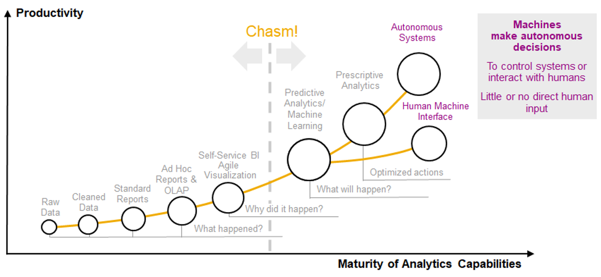

### Data Strategy - Câu hỏi lớn

1. Khoanh vùng các mảng: 
   - Customer/Market
   - Fin (Rev/Cost)
   - Operations (CVR, Channel)
   - People
2. Các câu hỏi trong từng mảng
3. Xác định mức độ ưu tiên => Shortlist
   - Các câu hỏi quan trọng nhất? 
   - Câu nào trước câu nào sau? 
   - Đi từng mảng hay tất cả (các mảng nào liên quan)
4. Các Metrics để trả lời?
5. Visualize, Insights, Communications

|     Mảng    	|     Câu   hỏi    	|     Metrics    	|     Giải pháp    	|
|---	|---	|---	|---	|
| Khách hàng/ Thị trường    	| 1. Tập   khách hàng quan trọng nhất? 2. Họ   là   ai? 3. Xu hướng thị trường?   4. Khách   hàng thích gì?    	| 1. Lifetime Value (bao nhiêu giao dịch, giá trị mỗi giao dịch) 2. CVR (Conversion Rate): Visit, Order, Chuyển khoản 3. Ratings    	| 1. User Segmentation  2. LTV / Churn prediction 3. User Path 	|
| Tài chính (Revenue/Cost) 	| 1. Đang lời/lỗi? 2. Mảng sinh lời nhiều nhất? 3. Hiệu quả? 	| 1. Revenue/Cost/Profit 2. ROI 	| 1. Time-series Prediction 2. Break-down (leading metrics) 	|
| Vận Hành 	| 1. Khách hàng đang “kẹt" ở bước nào? 2. Mảng nào đang hoạt động tốt? 	| 1. CVR 2. Engagement Metrics 3. Quality metrics 4. Capacities/ Resource Allocation 	| 1. Dynamic Allocation 2. Dynamic Pricing 	|
| Con người 	| 1. Nhân viên nào đang hoạt động hiệu quả? 2. Nhân viên nào quan trọng 	| 1. Activity metrics (calls/emails) 2. CVR 3. KPI (final target) 	| 1. Segmentation 	|

### Data Solution - Cycle of Development

**1. Tìm hiểu các Dữ liệu DN đang có**
   - Files rời rạc, update thủ công, không tạo thành bức tranh toàn cảnh.
**2. Đề xuất Data Model cho DN**
   - Phục vụ việc tổ chức data hiệu quả và linh động.
**3. Initial Insights & Data Strategy**
   - Phân tích tìm insights nếu có trong dữ liệu hiện tại
   - Đề xuất Chiến lược dữ liệu

### Data Solution - Event Avenue Booking Business

Câu hỏi lớn của DN
- Khách hàng
  - Ai là khách hàng quan trọng nhất?
  - Làm gì với từng nhóm khách hàng khác nhau?
- Vận hành
  - Khía cạnh nào trong sản phẩm không được đánh giá cao?
  - Tối ưu chúng như thế nào?

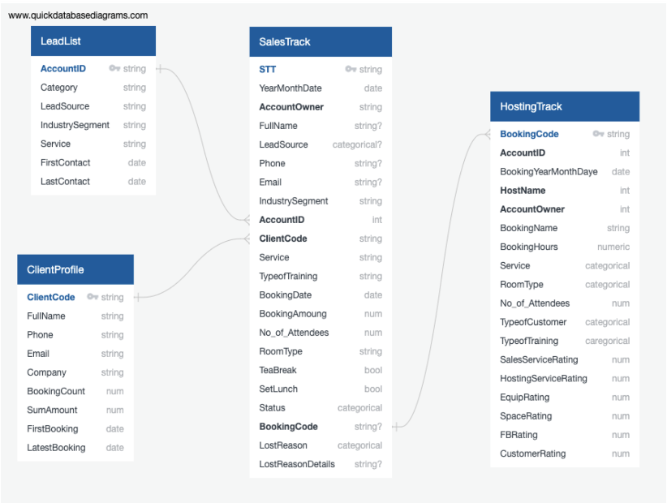

### Case Study

#### Cải Thiện Sản Phẩm

1. Phân tích tương quan giữa các yếu tố ratings 
2. Hệ số tương quan: -1 tới +1
3. Metrics: 
   - Lần booking gần nhất (min_ddiff_since_last_booking) 
   - Số lần booking (acc_freq)
   - Size (avg_no_of_attendee)

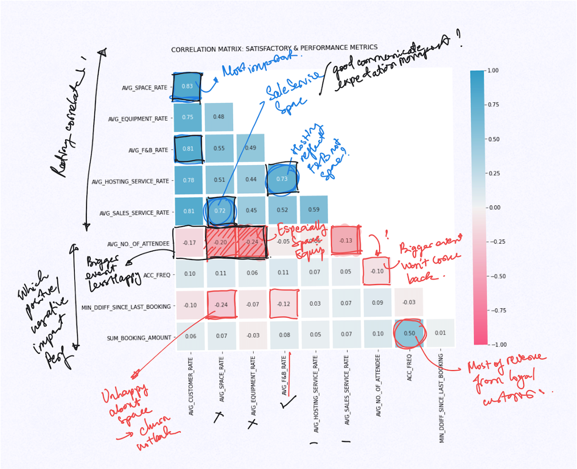

#### Phân Loại Khách Hàng

1. Pareto 80:20 
2. RFM (Recency - Frequency - Monetary)
3. Before: 
   - Tập trung vào các khách hàng lớn
   - Insights: Khách hàng nhỏ trở lại thường xuyên hơn và tạo ra nhiều Revenue hơn

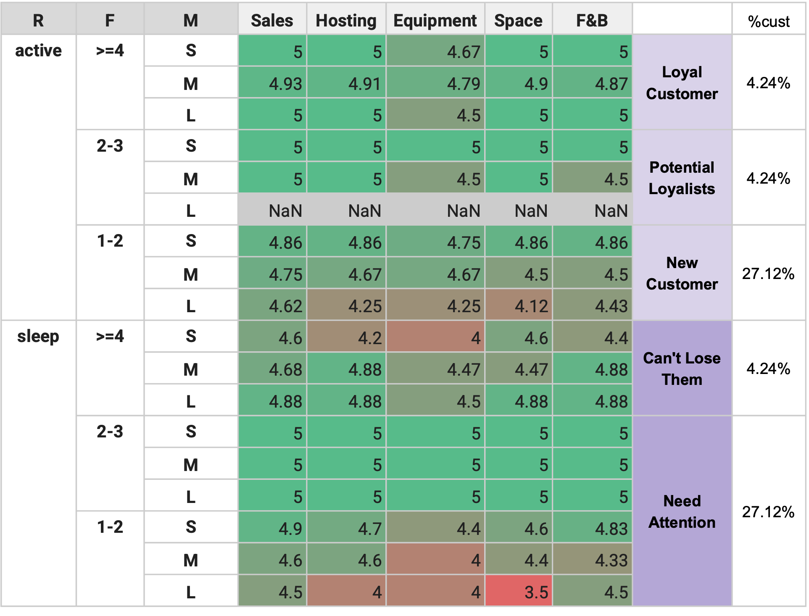

#### Dự đoán

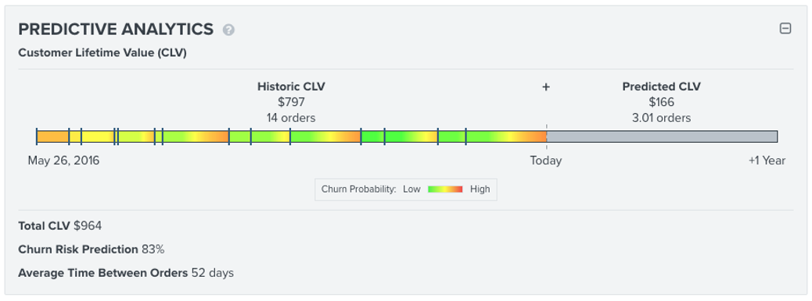

### Take-away #3: DN nhỏ và siêu nhỏ vẫn có thể có Chiến lược dữ liệu

1. Một chiến lược tốt không phục thuộc vào việc DN đang có dữ liệu gì?
2. Xoay quanh các vấn đề cụ thể mà DN quan tâm, cần giải quyết
3. Chiến lược cần đem lại các giá trị hữu hình
4. Bắt đầu “thật" đơn giản: Không cần trả lời tất cả câu hỏi

## Data Strategy in Action

1. SMART
   - Specific
   - Measurable
   - Achievable
   - Releastic
   - Timely
2. Ownership: “Sự nghiệp của mọi nhà"
3. Chia-để-Trị: Milestones 
4. Data-driven Culture
   - Tin và sử dụng data trong vận hành và ra quyết định
   - BI tools (Dashboard)
   - Data Literacy

## Nguồn tham khảo

> Slide: [DATACracy \| Datatalk Premium\#1 \|  Data Strategy](https://docs.google.com/presentation/d/1YRDjcK6as04WxGga0rPQMyd1AwJmL3ySFDfgVUCpGjs/edit#slide=id.gcf12cb55cb_0_0)

* Sách: [Chiến lược dữ liệu. Bernard Marr.](https://tiki.vn/chien-luoc-du-lieu-p10397239.html?spid=10397240&utm_source=google&utm_medium=cpc&utm_campaign=SEA_NBR_GGL_SMA_DTP_ALL_VN_BK_UNK_UNK_C.ALL_X.12507845980_Y.118674733323_V.10397240_W.DT_A.1187709498666_T.pla-1187709498666_O.UNK&gclid=Cj0KCQjw6-SDBhCMARIsAGbI7UinGYkbF87BQ25gZzKu0t7bvC1Y80bYsT2ZxlV57j0Md0SUXLWZRXwaAqXlEALw_wcB)
* Đọc thêm: [Big Data](../../big-o/1-hello-world/big-data.md)

