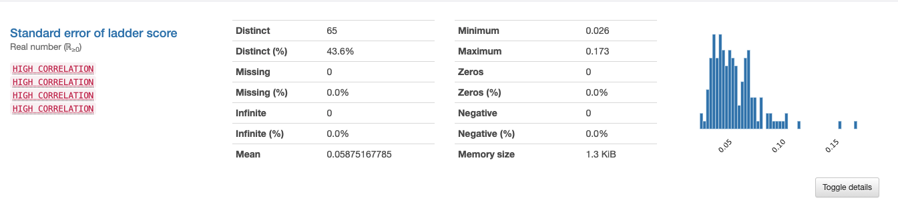

# 7.1 - EDA & Statistics

## EDA

**EDA \(Exploratory Data Analysis\)** là việc phân tích để khám phá và tìm hiểu về data. Khác với nhiều dạng phân tích có mục đích rõ ràng, EDA đúng như tên gọi của nó giúp người làm việc với data hiểu về cấu trúc và tính chất data mình đang làm việc.

> Quá trình này có thể gọi là giúp bạn "cảm" data. Có những hiểu biết để thực hiện các bước xử lý tiếp theo \(Data Processing, Feature Engineering, Feature Selection - Sẽ nói ở các phần sau\).


Đây là một chủ đề lớn trong lĩnh vực dữ liệu. Nhưng tóm gọn lại, bạn cần làm các bước sau:

1. Hiểu nguồn gốc và cách thu thập dữ liệu
2. Quyền sử dụng \(Commercial or Non-commercial, bảo mật, etc.\)
3. Tên các cột và ý nghĩa
4. Tìm hiểu phân phối của các biến \(**Univariate Analysis**\)
5. Tìm hiểu mối quan hệ giữa các biến \(**Multivariate Analysis**\)


Có nhiều công cụ để cho phép bạn "cảm" data. Ví dụ như, Data Explorer của Kaggle. Hay, Glimpse Data Tool \([Streamlit App](https://share.streamlit.io/anhdanggit/streamlit-data-glimpse/main/app.py), [Github Code](https://github.com/anhdanggit/streamlit-data-glimpse)\).


Kỹ năng về pandas và visualizations sẽ giúp bạn trong EDA


## Statistic Summary

Trong phạm vi của Atom, các concept về Statistics sẽ được giới thiệu đến bạn thông qua thực hành EDA.


Giả sử bạn có thể download một bộ data bất kỳ trên Kaggle \(Ví dụ: [World Happiness Report 2021](https://www.kaggle.com/ajaypalsinghlo/world-happiness-report-2021)\) và dùng công cụ [HERE](https://share.streamlit.io/anhdanggit/streamlit-data-glimpse/main/app.py) để khám phá data.


Từ một bộ data có 149 dòng x 11 cột, ta tổng hợp được thành bảng có 11 dòng x 10 cột như sau:

Mười dòng này cho ta bức tranh tổng hợp \(**Summary**\) về Data, và các thông số Min, Max, Count, Average, Median, q25, q75, q99 là **statistics** \(chỉ số thống kê\).

> Statistic Summary giúp ta tổng hợp và mô tả data bằng các thông số thống kê.


Bí kíp để nhớ là các con số thống kê giúp bạn giống như chỉ số ba vòng của hoa hậu, giúp chúng ta thông qua những con số hình dung được các đường cong. Cụ thể, là đường phân phối của dữ liệu.


> Bạn có thể đọc lại: [Data Thinking - Xác suất & Giả-thuyết-không](../../big-o/3-data-thinking/xac-suat-and-gia-thuyet-khong.md#phan-phoi-cua-data)

Phân phối sẽ quen thuộc với bạn thôi, vì nó bản chất là biểu đồ cột, với trục x là các khoản giá trị có thể quan sát được, và trục y là số quan sát đếm được trong khoản giá trị đoá.

> Cũng chính là bài tập [Visualization](https://www.kaggle.com/alexisbcook/distributions) - [Home Assignment \#6](../6-cloud-function-and-streamlit/6.4-home-assignment-6.md)

Có rất nhiều chỉ số thống kê, nhưng với "đường cong" của phân phối thì các chỉ số quan trọng để mô tả:

* **Tính đại diện:**
  * Đỉnh \(Mode\) - Giá trị phổ cập nhất
  * Điểm trung tâm \(Min\) - Giá trị trung bình chúng ta quen thuộc
* **Độ dàn trải:**
  * Phương sai \(Variance\)
  * Độ lệch chuẩn \(Standard Deviation\)
  * Min - Max
  * Tứ phân vị \(quantile\): 25%, 50%, 75% ⇒ Lần lượt chia phân phối thành 4 phần bằng nhau về số đếm quan sát ⇒ 25% mẫu có giá trị thấp hơn giá trị tứ phân vị 25%
  * Percentile \(ý tưởng tương tự\) ⇒ Percentile 5% là mức mà chỉ có 5% mẫu có giá trị quan sát nhỏ hơn mức đó. Như trong ảnh trên đường tím ở percentile 80%

## Profiling Data

[Tool Glimpse Data](https://share.streamlit.io/anhdanggit/streamlit-data-glimpse/main/app.py) được "build-on-top" của [pandas-profiling](https://github.com/pandas-profiling/pandas-profiling). Sẽ tự động giúp bạn làm các bước "standard" của quá trình EDA \(như nhiều trường hợp, bạn vẫn cần dùng kỹ năng Pandas và Data Viz để trả lời các câu hỏi sâu và cụ thể hơn\)

### Univariate Analysis


Bạn cần chú ý:

* Histogram của biến:
* Tỷ lệ missing
* Mean, Min, Max


Tuỳ từng loại phân phối có những cách xử lý khác nhau. Nhưng nhìn vào histogram đơn giản nhất giúp ta biết có cần xử lý outliers không, scaling giữa các biến, xử lý giá trị missing? \(Tìm hiểu thêm qua các notebook trên Kaggle\).

### Multivariate Analysis

> Chủ yếu phát hoạ mối quan hệ giữa các biến với nhau.


Bạn có thể nhìn vào **Correlation Matrix** để tìm các biến có tương quan:

* Giá trị càng gần 1 thì tương quan thuận mạnh \(biến này tăng thì biến kia tăng và ngược lại\)
* Giá trị càng gần -1 thì tương quan nghịch càng mạnh \(biến này tăng thì biến kia giảm\)
* Càng gần về 0 thì không có tương quan


Sau khi đã xác định các biến có correlation \(lưu ý chỉ số tương quan chỉ là một con số\), bạn có thể vẽ đồ thị điểm \(scatterplot\) với mỗi trục là mỗi biến, để quan sát mối quan hệ giữa hai biến với nhau.

## Recap

* **EDA \(Exploratory Data Analysis\)** là việc phân tích để khám phá và tìm hiểu về data. Khác với nhiều dạng phân tích có mục đích rõ ràng, EDA đúng như tên gọi của nó giúp người làm việc với data hiểu về cấu trúc và tính chất data mình đang làm việc.
* Đây là một chủ đề lớn trong lĩnh vực dữ liệu. Nhưng tóm gọn lại, bạn cần làm các bước sau:
  1. Hiểu nguồn gốc và cách thu thập dữ liệu
  2. Quyền sử dụng \(Commercial or Non-commercial, bảo mật, etc.\)
  3. Tên các cột và ý nghĩa
  4. Tìm hiểu phân phối của các biến \(**Univariate Analysis**\)
  5. Tìm hiểu mối quan hệ giữa các biến \(**Multivariate Analysis**\)
* Từ đó, có các bước để xử lý dữ liệu ở các bước tiếp theo, ví dụ: Xử lý outliers, xử lý missing values, biến đổi các biến.

