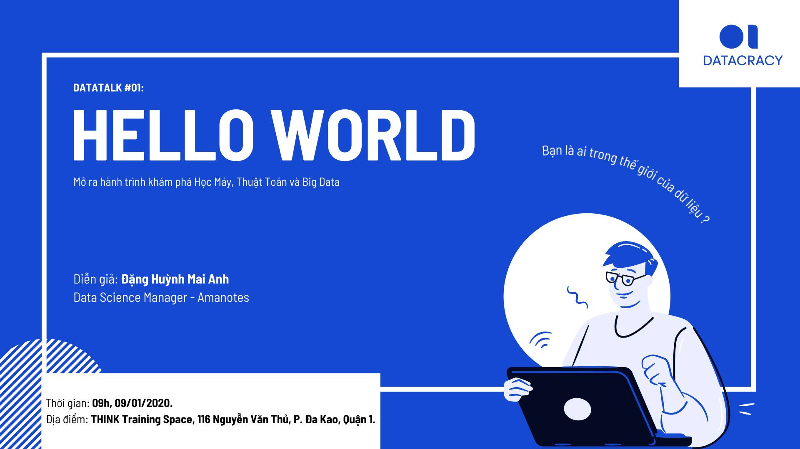

# Datatalk\#1 - Hello World

## **Dẫn nhập**

Như vậy, nếu bạn đã ở đây là đang đọc những dòng này, bạn chí ít đã bước một vài bước vào Hành trình của chúng tôi. Hành trình để giải thích, để hiểu, để tiên đoán \(và tưởng tượng\) về muôn vàn khả năng có thể với Data, Thuật Toán và những công nghệ xoay quanh.

`HELLO WORLD.`

Hầu như tất cả các lập trình viên, nhà khoa học dữ liệu, nhưng ai từng và sẽ "code" \(lập trình\) sẽ viết dòng lệnh đầu tiên như vậy: `print("Hello World")`

Hello World. Trở thành một cụm từ kinh điển bắt nguồn từ những năm 1970, bởi Brian Kernighan trong cuốn giáo khoa lập trình kinh điển của ông, cùng thời điểm đó máy tính đã có những phát triển vượt bậc, tiến hoá gần giống với máy tính cá nhân mà chúng ta có ngày này - nghĩa là có bàn phím, màn hình và con trỏ nhấp nháy.

"Hello world" mở ra cuộc chuyện trò đầu tiên của người và máy.

Nguồn cảm hứng cho cụm ký tự kinh điển đó đến từ một cảnh phim hoạt hình: Một con gà con nở ra khỏi vỏ, rồi thay vì chíp chíp nó kêu lên không ngừng: `"Hello world! Hello world"`.

Còn, trong câu chuyện Người và Máy thì sao?

Là con người đã tiến được vào kỷ nguyên máy tính và mở ra một thế giới mới. Hay, là máy tính đã thức dậy khỏi đám đinh ốc, sắt thép vô tri, bước vào thế giới của con người, hình thành nên Trí tuệ nhân tạo?

Đối với tôi, đó là khoảng khắc ngồi trước màn hình, và một thế giới mới mở ra với tôi. Vào những ngày đầu tiên tôi học code, và rồi bắt đầu một hành trình không dài nhưng không ngắn với Data. Để ngày hôm nay, để chào đón bạn, tôi mượn lại cụm ấy: `"Hello world"`.

Ngoài ra, trong bối cảnh của thời đại chúng ta sống, khi máy tính, dữ liệu và thuật toán đang ngày càng chi phối và định đoạt tương lai của chúng ta, cho tôi mượn "Hello world" như một biểu tượng để gợi nhắc về khoảnh khắc tương tác đầu tiên giữa: Máy tính và Con người đó - Mở ra một hành trình của những khả năng, một thời kỳ mà ở đó ta không thể tách rời Con Người khỏi Máy móc và ngược lại.

Ngày nay, lằn ranh điều khiển và bị điều khiển giữa người và máy càng trở nên mong manh. Điều đó thôi thúc chúng tôi muốn thực hiện **DATAcracy**. Khi trao đổi về Học Máy, Thuật Toán và Data, thật ra chúng tôi muốn nói về Con Người - về chính Chúng ta.

Chúng ta là ai, và chúng ta thay đổi thế nào trước công nghệ. Mối quan hệ của chúng ta với data, với thuật toán.

Chúng ta đã nghe ra rả rất nhiều về Big Data và những thuật toán. Rằng AI, rằng Machine Learning. Rằng chúng tạo ra doanh nghiệp bạc triệu, những phát minh tưởng như giả tưởng. Chúng hỗ trợ con người, sửa sai cho con người, và thay thế chính con người. Tìm đường, gợi ý phim/nhạc, mua sắm, hẹn hò — Khi nào ta có thể tin tưởng tận hưởng sự tiện lợi, khi nào ta cần cảnh giác trước sự thao túng của Thuật Toán?

Chúng tôi không thể đưa cho bạn câu trả lời. Bởi không có phát minh hay thuật toán nào là tốt hay xấu trong bản chất. Chính con người và cách chúng được sử dụng mới đáng nói. Qua **Datatalk\#1**, DATACracy chỉ muốn mở ra một số góc nhìn ở cả hai mặt của vấn đề. Để chính chúng ta sẽ nhìn vào chúng ta, tìm thấy chính mình, giữa mối tương quan với Data và Thuật Toán.

Bởi chúng tôi tin rằng, một cách tốt để bảo vệ Con Người trước những mặt trái của Thuật Toán, là giúp họ hiểu hơn về nó.

## **Datatalk\#1 - Agenda**


## **Datatalk\#1 - Hello World**

1. Trước **Datatalk\#1**, Người Tham Gia được khuyến khích đọc trước tài liệu:
   * [Mặt Trái của Big ](mat-trai-cua-big-data.md)
   * [Truyện ngắn: Học-máy](truyen-ngan-hoc-may.md)
2. Trong **Datatalk\#1**, buổi workshop sẽ trao đổi và thảo luận dựa trên nội dung của 04 bài đọc:
   * Thường thức về Thuật Toán
   * Thường thức Big Data
   * Mặt Trái và Bảo Vệ Dữ Liệu Cá Nhân
3. **Datatalk\#1** sẽ kết hợp: \(1\) Trao đổi/hỏi đáp giữa người tham gia - khách mời; \(2\) Các hoạt động Tương tác + DataYourself
4. Sau **Datatalk\#1**, Người Tham Gia được khuyến khích đọc tiếp:
   * Tiếp tục khám phá: [https://experiments.withgoogle.com/collection/ai](https://experiments.withgoogle.com/collection/ai)
   * Chia sẻ quan điểm và giúp lan truyền thông điệp của dự án với hashtag `#DATACracy` `#BigO_Datatalk` `#HelloWorld`
   * Theo dõi và đọc các nội dung tiếp theo của **DATACracy**


## **Nguồn tham khảo**

1. H. Fry _\(2018\). Hello world: Being human in the age of algorithms._ WW Norton & Company.
2. D. Spiegelhalter \(2019\). _The Art of Statistics: Learning from Data_. Penguin UK.
3. Đặng Huỳnh Mai Anh \(2018\). _Mặt Trái của Big Data_. [Medium](https://medium.com/@anh.dang./m%E1%BA%B7t-tr%C3%A1i-c%E1%BB%A7a-big-data-6f09e1b236eb).
4. Đặng Huỳnh Mai Anh \(2020\). _Truyện ngắn Học Máy. Trích Tập truyện ngắn Hai-Mươi-Bảy._ NXB Thế Giới.
5. [Black Mirror. _Series 3. Episode 1. Nosedive_](https://en.wikipedia.org/wiki/Nosedive_%28Black_Mirror%29) \(Directed by Joe Wright, Story by Charlie Brooker\)
6. [The Social Dilemma](https://en.wikipedia.org/wiki/The_Social_Dilemma#:~:text=The%20Social%20Dilemma%20is%20a,Davis%20Coombe%2C%20and%20Vickie%20Curtis.%29) \(2020\). Documentary \(Directed by Jeff Orlowski\)

