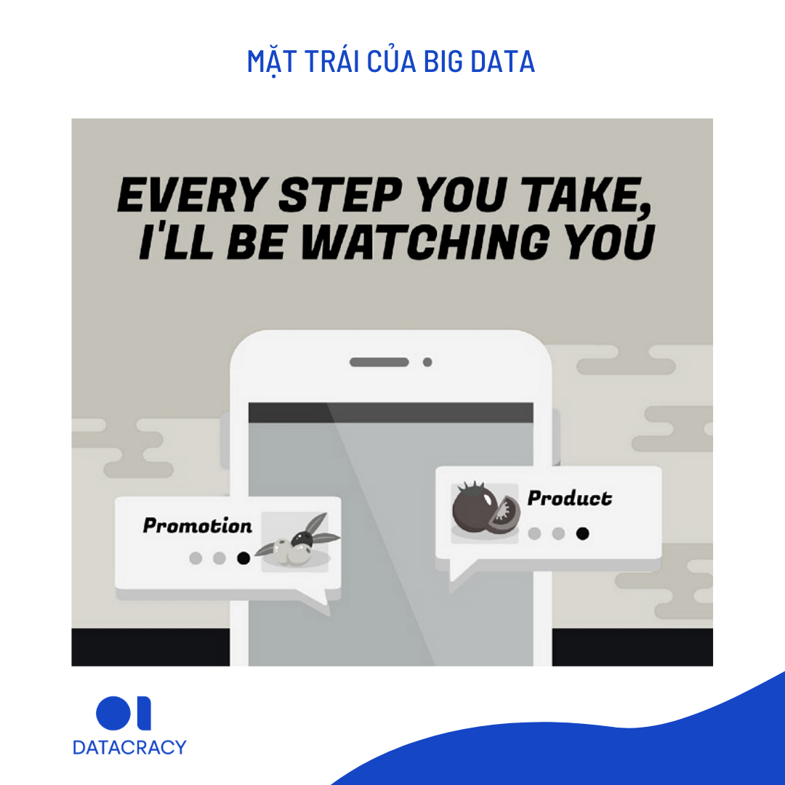

# Mặt Trái của Big Data

Gần đây mình có tải về một ứng dụng rất hay. Ứng dụng này cho phép mình có thể scan mã code của mỗi món thực phẩm mua từ bất kỳ siêu thị và cửa hàng nào. Trong một chớp mắt, ứng dụng có thể cho mình ratings của sản phẩm đó: “Rất tốt”, “Tốt”, “Trung Bình”, “Xấu”. Đánh giá theo liều lượng, thành phần và các chất phụ gia, bảo quản trong sản phẩm. Thông minh hơn, ứng dụng sẽ lưu lại history ăn uống của mình, đưa ra con số thống kê, phân tích thói quen ăn uống, tạo thành một biểu đồ tròn hình dĩa thức ăn khá xinh xắn và trực quan. Tính mở của ứng dụng rất cao, cho phép người dùng đóng góp thông tin vào kho data của họ: Nếu bạn không tìm thấy một mã code nào đó có sẵn, bạn có thể nhập thông tin vào trong hệ thống.

Một ý tưởng tuyệt vời, và bản thân mình rất hứng thú. Cũng như mình, rất rất nhiều users đang tải về, yêu thích và sử dụng ứng dụng này.

Nhưng, khi chợt nhớ ra rằng một lượng thông tin lớn kinh khủng về thói quen ăn uống, những sản phẩm đang được ưa chuộng, tần suất mua mỗi tuần, mỗi tháng. Lượng thông tin đó sẽ đi về đâu, và phục vụ cho ai?

Cũng như rất nhiều các apps tiện ích khác, mỗi ngày mỗi giờ, mỗi nơi bạn qua, mỗi hoạt động trong ngày, mỗi key words bạn tìm kiếm. Chúng đều đóng góp vào kho thông tin lớn khủng khiếp đó.

Big Data, một bước tiến của loài người, dần dà trở thành tên gọi của cả một thời đại đang tới. Cũng như rất nhiều thứ con người từng nghĩ ra, Big Data là một công cụ cũng có thể là vũ khí, tốt hay xấu tuỳ thuộc vào việc nó nằm trong tay ai.

Bạn biết không, có thể sau những hào nhoáng và tôn vinh về sức mạnh của Big Data, chưa nhiều người nói về sự đáng sợ của nó. Nhất là khi trong thời đại của Big Data và thuật toán, chúng ta, những người tiêu dùng, lại đứng trong bóng tối của câu chuyện.

Đây không phải là bài viết để phủ nhận sạch trơn những tiện tích và giá trị mà Big Data đem lại. Nhưng bạn có thể tìm đọc về điều đó ở rất nhiều bài viết khác trên Internet, riêng bài viết này sẽ dành để nói về mặt trái của Big Data

## **1. Cú lừa của sự tiện ích**

Sự bùng nổ của các apps, các công cụ và ứng dụng mới của thời đại đến với chúng ta thông qua sự tiện ích, không thể chối cãi. Gần đây, và đang được đẩy mạnh quảng bá, được giới thiệu như những _trợ lý ảo_, khởi đầu với Siri của Apply, theo sau là Google Assistant, Alexa của Amazon, Cortana cho Windows. Trí tuệ nhân tạo ấy giúp đỡ chúng ta từ đặt lịch hẹn, cho đến shopping, giới thiệu chỗ ăn uống và tìm kiếm thông tin.

> Bằng việc triệt tiêu yếu tố con người trong việc tìm kiếm, con người dần phụ thuộc vào những super-platform, và giao phó cho các trợ lý ảo, toàn bộ quá trình tìm kiếm thông tin, đánh giá, phân loại ưu tiên và diễn giải kết quả. — Ezrachi and Stucke, 2016

Tôi hay đùa bằng việc đem Siri của tôi ra hỏi: **“Hey Siri, Samsung or Apple is better?”** \(Bạn cũng có thể thử với trợ lý ảo của bạn\).

Siri của tôi trả lời: “**Personally, I’m an Apple fan”**.

Nghe rất hài và có phần đáng yêu, nhưng phía sau đó… chắc bạn cũng hiểu ý tôi muốn nói.

## **2. Sự mất mát vô hình**

Cách đây mấy hôm, tôi xem một video ngắn về cuộc điều tra / thử nghiệm tính bảo mật. Người ta kiểm tra và thấy ngay cả khi chuyển smartphone sang chế độ máy bay, một lượng data vẫn âm thầm đẩy lên từ thiết bị, cho “họ” biết bạn đã đi đâu, dừng lại chỗ nào, bao nhiêu phút?

Cuối đoạn, videos bài “_Every Breath You Take”_, được ghép vào một cách hết sức mỉa mai:

> Every step you take. I’ll be watching you.

Chúng ta đang chịu một sự mất mát, nhưng không thấy nó là vấn đề lớn, vì nó là sự mất mát vô hình: Thông tin cá nhân và thói quen tiêu dùng.

Từ lượng thông tin khổng lồ mà họ có, ngay lập tức những quảng cáo liên quan xuất hiện trên mọi platforms bạn tham gia. Đó gọi là **“extraction and capture” strategy**: \(1\) trích xuất \(extract\) thông tin cá nhân; \(2\) “vây bắt” \(capture\) bằng cách quảng cáo được thiết kế từ nghiên cứu tinh vi về tâm lý và hành vi.

Targeted ads và online marketing không chỉ mang tính giới thiệu và gợi ý sản phẩm, chúng ảnh hưởng lên quyết định và cổ suý tiêu dùng.

Marketing không mới, nhưng sự hiện diện của Big Data và khả năng khai thác dữ liệu lớn đưa marketing và quảng cáo lên một tầng sức mạnh mới. Nếu trước đây các thông điệp và chiến dịch quảng bá phải dựa trên nhạy cảm thị trường, có thắng có thua, có rủi ro được đón nhận hoặc không. Thì bây giờ, họ hiểu bạn hơn cả bản thân bạn, đưa ra những dịch vụ và nội dung quảng cáo tuỳ chỉnh cho chính bạn. Bạn không thể từ chối…

Có người từng nói, đây là thời đại mà sức mạnh của một người dân bình thường đến từ sự tiêu dùng. Mỗi quyết định tiêu dùng có thể ví như một lá phiếu đầu. Chúng ta tẩy chay một sản phẩm để thể hiện sự bất bình và yếu sách thay đổi. Chúng ta ủng hộ một sản phẩm cũng từ việc tiều dùng.

Quyền lực đó của chúng ta đang bị rút đi, từ từ và lặng lẽ…

## **3. Thâu tóm thị trường**

Giá trị của một sản phẩm, có thể chia thành hai phần: Giá trị sử dụng và giá trị về mặt tâm lý. Nếu trước đây nền kinh tế dựa nhiều trên giá trị sử dụng để định giá và phân biệt giữa các sản phẩm. Thì càng ngày, chúng ta càng dịch chuyển về giá trị tâm lý: Sự khác biệt về giá trị sử dụng không nhiều, nhưng mẫu mã và thông điệp quảng cáo làm người dùng đánh giá chúng khác nhau. Big Data và những hiểu biết cặn kẽ hơn về tâm lý và hành vi của người dùng, có khả năng đẩy chúng ta đến điểm cực nới giá trị tâm lý chi phối hoàn toàn: Bạn không trả tiền cho sản phẩm, bạn trả tiền cho marketing, cho cách nó được giới thiệu cho bạn.

Và, họ không hoạt động đơn lẻ. Trong thị trường high-tech, nhiều nhà kinh tế cho rằng sự cạnh tranh chỉ mang tính hình thức, hay còn gọi là “Frenemies” \(Friend-enemy\). Các super-platforms có thể trao đổi với nhau và tiếp cận với mọi nguồn data thông qua các apps trong hệ thống của họ. Họ có thể gây sức ép lên các apps nhỏ \(như apps về thực phẩm mình nói ở đầu bài\), để tiếp cận được nguồn thông tin tiêu dùng của bạn. Họ có thể hất cẳng một apps đi ngược lại lợi ích của họ, bằng việc khiến apps chạy chậm hơn, hoặc giảm hiệu quả và chất lượng vận hành. Như câu chuyện về _Disconnect_ 1, một app cho phép theo dõi và block các tracking thông tin cá nhân ngầm. Để đến với người dùng, Disconnect phải phân phối qua Google Play và nhanh chóng bị xoá sổ vì đi ngược lại với chiến lược “extraction and capture”, ngăn cản việc thu thập thông tin cá nhân.

Thực tế, để hạn chế vấn đề này, nhiều quy định được đưa ra về tính khách quan và bảo mật cá nhân của các thuật toán. Nhưng, các ông lớn thì quá nhiều quyền lực để “lobby”, còn người tiêu dùng cũng chưa mấy quan tâm đến sự chi phối đang không ngừng tăng lên.

> Quyền lực kinh tế sẽ chuyển hoá thành quyền lực chính trị, tạo ra khả năng ảnh hưởng lên các chính sách. — Ezrachi and Stucke, 2016

Như tôi đã nói, chúng ta ở bên phía bóng tối của thời đại Big Data và nền kinh tế được vận hành bởi thuật toán. Là những người tiêu dùng bình thường, thứ chúng ta tiếp xúc là những giao diện đẹp, những thành phẩm **front-end**. Chúng ta không biết và không thể biết phía **back-end**, thuật toán vận hành nó là gì?

## **Nguồn tham khảo**

_Ezrachi & Stucke \(2016\). Book Review: The Next Frontier of Antritrust?. In: Virtual Competition: The Promise and Perils of Algorithm-Driven Economy. Harvard University Press._

