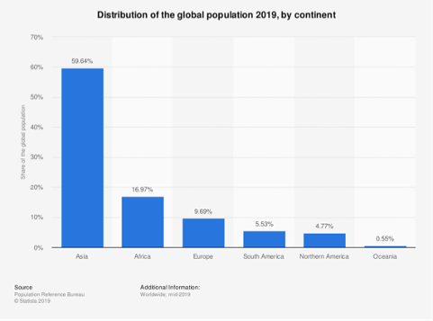
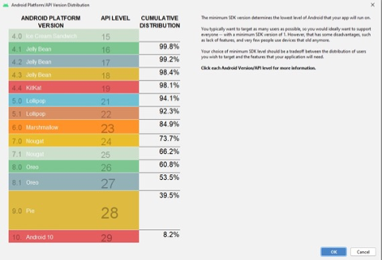
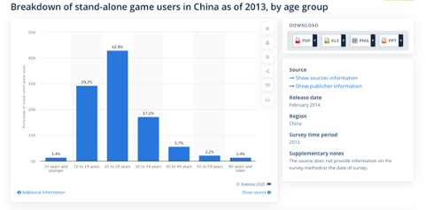
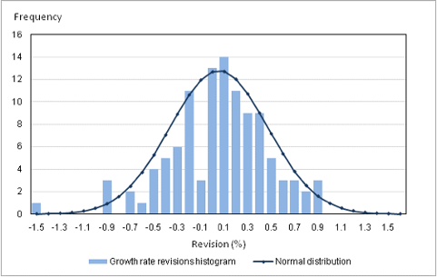
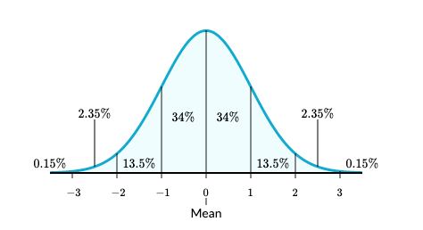

# Science of Counting

> If I have a chance to introduce about Statistics in the most simple \(and approximate\) definition, I will say: the Science of Counting. To explain that, let me talk about some of most fundamental concepts in Statistics in the sense of counting.

## 1. Distribution

Just like the name, this concept is to present how a group of observations \(populations\) distribute along some “buckets” \(some others might call them “bins”\).

In the example blow, we have this graph by: 

1. `Bucketize` the global population by continent \(Asia, Africa, Europe\) 
2. `COUNT` the number of people per continent 
3. The share of global population \(%\) = `COUNT` of people per continent / `COUNT` of people in all continent

Naturally, if you add the count at all “bucket” you will have the count of the whole population, because one observation should find one bucket they belong to \(so no one will be alone\). By that, the sum of percentage in each bucket will equal 100% \(**Completeness**\).

## 2. Cumulative Distribution

Following exactly same concept of “**Bucket & Count**”, now, our population is all API version, and we “bucketize” by Android Platform. The graph is from XDA Developers, the title is “Android Platform/API Version Distribution”.

The business question we aims to answer: 

* Target as many user as possible \(highest possible in % of device we covers\): Distribution of User Devices 
* Feature level of the version \(by API level\)

Though the appearance is different, the procedure to have the graph is same: 

1. “bucketize” the all API versions \(observation\) by platform-API level 
2. COUNT the number of user device per platform 
3. But the percentage is not `count per bucket / sum of count all buckets` any more

The new concept over there is **Cumulative Distribution**, keep in mind that this is just another way to tell the story, depending on the answer you want to have, you choose the way to present the data.

If my question is **“How many top platform version cover &gt;30% of API levels?”,** I will think about **Cumulative Distribution.** Look into the graph, you will notice they are ranking from high to low in the count of API level. Android 10 takes for 29 API levels, Pie in the second place with 28, Oreo 8.1 with 27. The logic of cumulative distribution is: 1. Top 1 \(Android\) take for 8.2% of population \(count of devices, notice that now we change the metrics, it is not API level as in the count\) 2. Top 2 \(Pie\) take for additional 31.3% of devices → Cumulative Distribution: 31.3% + 8.2% = 39.5%

## 3. Continuous number?

OK. Things seem simple, as in example above, buckets are separate and straightforward. How about the case that the measure is continuous or we have many values, such as: ages \(integers from 0 to 100\), salary, etc.

You can “bucketize” them to serve your purpose. In the screenshot below from [statistia.com](www.statistia.com), the age is “bucketize” into 7 groups, with the range of value: =&lt;10, 10-19, 20-29, 30-39, 40-49, 50-59, 60+

In theory, all measures could be **“bucketized”**. You can customize the number of buckets by change the size of it: Splitting/Grouping different buckets together. If you increase the number of “buckets”, the graph will become smoother, till you have a curve like below. The smooth version is the version of the Barnhart you see, when the number of buckets increase \(and the width of each bucket is very small\).

Then, you have the **Curve of Distribution** \(the fancy curve that you one time or another seeing in Statistic textbooks\). One of the most common distribution in nature is **Normal Distribution**, having the bell shape.

Important statistical metrics/concepts is designed around the distribution curve: 

1. Median / Mean / Mode 
2. Standard Deviation 
3. Variance 
4. Mode 
5. Quartiles / Percentiles / Inter Quartile Range 
6. Kurtosis 
7. Skew 
8. Effect Size / Statistical Significance

We might talk about these concepts in another articles.

## Reference

By the order appearing in the article. 

* [How to find the Android Version Distribution statistics in Android Studio ](https://www.xda-developers.com/android-version-distribution-statistics-android-studio/#:~:text=Developers%20can%20find%20the%20latest,SDK%20version%20for%20their%20application.)
* [China: stand-alone game user breakdown by age group 2013 \| Statista ](https://www.statista.com/statistics/310433/china-stand-alone-game-user-breakdown-by-income/)
* [Normal distributions review \(article\) \| Khan Academy ](https://www.khanacademy.org/math/statistics-probability/modeling-distributions-of-data/normal-distributions-library/a/normal-distributions-review)

